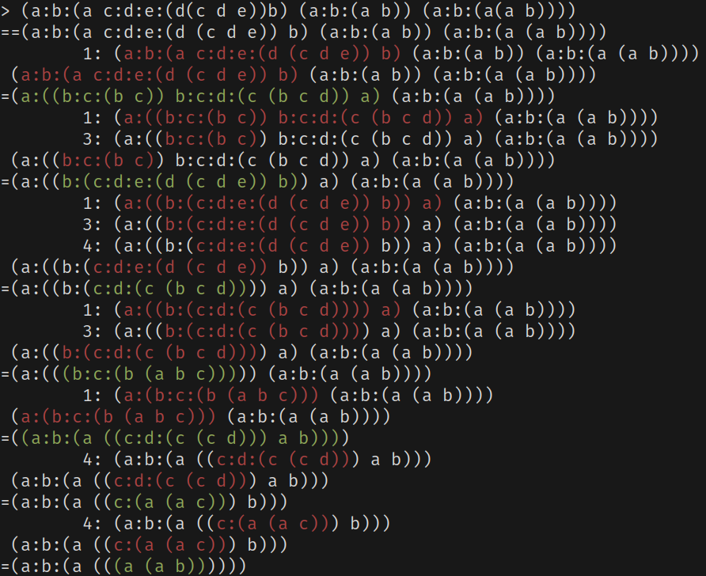
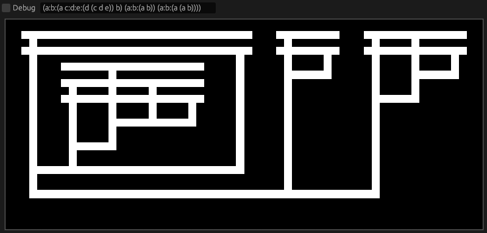

# Lambda Man

A project where I explore Lambda Calculus.

This project contains the lambda-man-engine and lambda-man-tromp.

The lambda-man-engine will evaluate the expression until is not able to perform a beta-reduction.

The lambda-man-tromp will generate a diagram similar to [Tromp Diagrams](https://tromp.github.io/cl/diagrams.html).

The lambda notation that this project is using is inspired by nix language, the syntax looks like this compared to the original lambda notation:

`λa.a` = `a:a`
`λab.a` = `a:b:a`

add 1 2
`(λm.λn.m (λn.λf.λx.f(n f x))n) (λf.λx.f x) (λf.λx.f(f x))` = `(a:b:(a c:d:e:(d(c d e))b) (a:b:(a b)) (a:b:(a(a b))))`

What is before a `:` is a definition and only one expression can be after `:` so you need to group other expressions, example:

`a:a a ` is invalid.
`a:(a a)` is valid.
`(a:(b:b a)` if this expression will be evaluated will result `a:a`.
`(a:(b:(b a)))` this cannot be evaluated and if two arguments will be added, after is evaluated will be in the reverse order.

